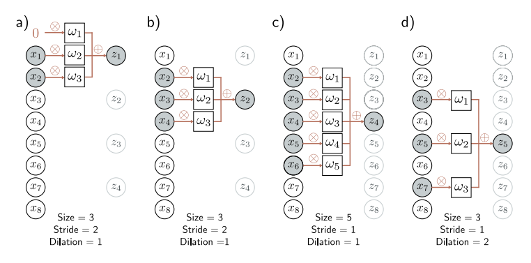
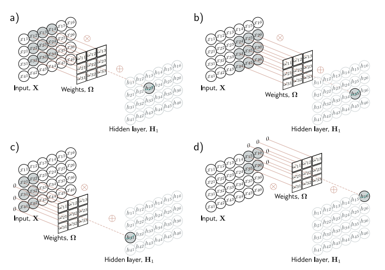
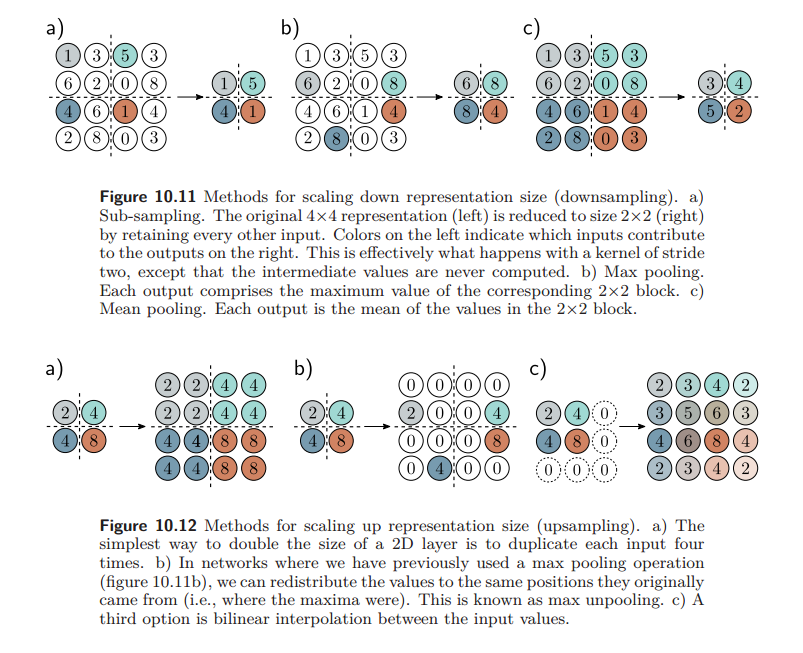
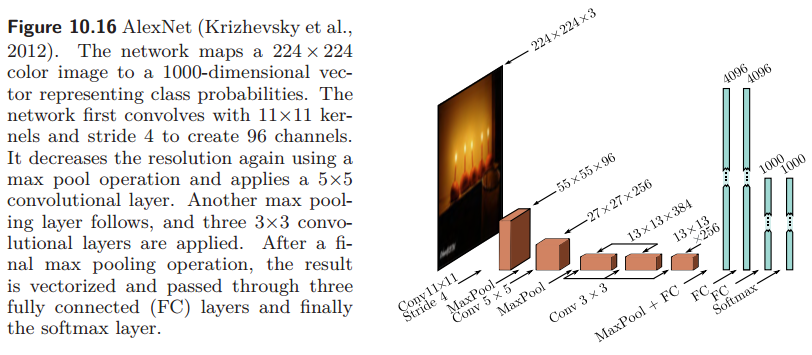
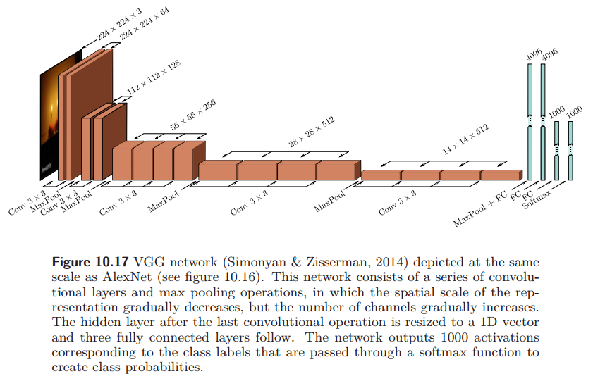
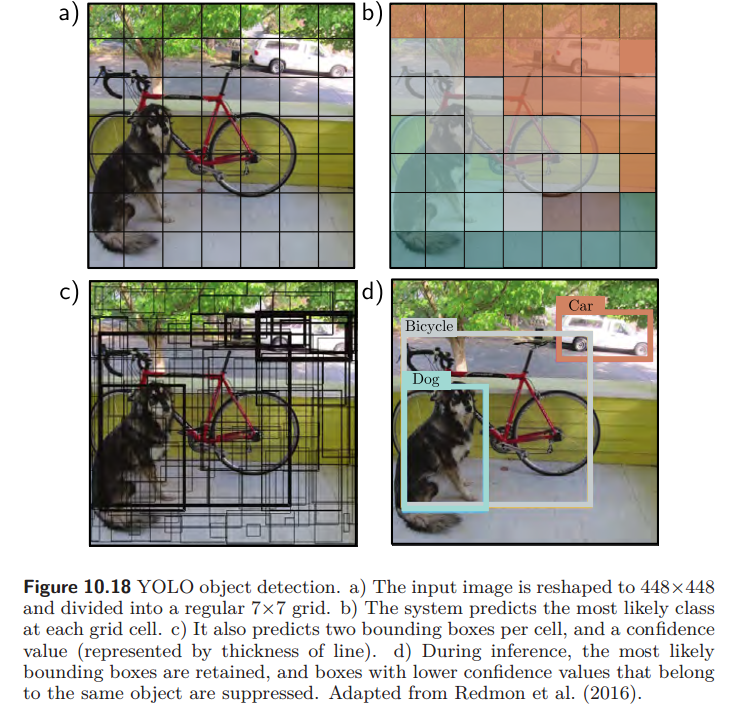
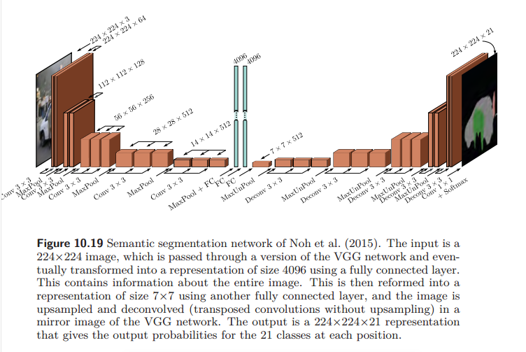

# Convolutional networks

## 1.为什么要开始使用卷积层

1. 全连接层在处理高维的数据是需要很多权重，极大消耗计算、存储资源

2. 对于图像，它是具有空间信息的（比如**相邻**），全连接层无法表示这些信息，比如将图像进行拉伸等变换，这种移动会改变网络的每个输入，完全连接的模型必须学习在每个位置分别表示树的像素的模式，这显然是低效的。

## 2.padding, Stride, kernel size, and dilation等概念

1. stride：卷积核每次移动的步长
2. kernel size: 卷积核大小
3. padding：在周围填充的大小
4. dilation:扩张大小，也就是卷积核两个格之间的距离，1就表示紧挨着，2表示中间隔一个格

## 3.卷积操作

1. 用卷积核依次遍历，并与input进行点积，生成新的特征图
2. 卷积核的大小一般是[n\*n\*channels], n为奇数

## 4.Downsampling and upsampling

1. 下采样是指将图像或特征图的分辨率降低的过程。它通过减少数据的维度来实现，常见的方法有池化、用较大步长的卷积或者通过专门的下采样层
2. 上采样是指将图像或特征图的分辨率提高的过程。它通过增加数据的维度来实现，常见的方法有最近邻插值、双线性插值、转置卷积或者通过专门的上采样层

## 5.应用

### 5.1 Image classification

通过卷积神经网络将输入图像进行分类，代表性的结构有AlexNet、VGG network

### 5.2 Object detection

目标检测中有You Only Look Once（YOLO）这些网络结构

它的大致步骤：

1. 将图像切分为规则的小网格
2. 预测每个网格最可能的类别
3. 预测每个单元的边界框和置信度
4. 在推断期间保留最可能的边界框，并抑制置信度低的框

### 5.3  Semantic segmentation

语义分割是进行像素级的分类，通过下采样提取信息，再通过上采样还原信息，输出是[原图像尺寸\*原图像尺寸\*类别数量的通道数]，所用的网络一般为encoder-decoder networks

## 6.思考

卷积操作是如何实现增加通道数的？

如上文所说，卷积核的大小一般是[n\*n\*channels], n为奇数。卷积核会在n个通道对Input进行卷积，然后将这n个通道卷出来的值进行相加，此时，这个表示的意义不再是图像的颜色深浅，而是一种更抽象的语义表示。所以一个卷积核卷拥有三个通道的一张图像得到的是一张特征图输出，所以新的通道数取决于卷积核的数量，不同的卷积核可以提供不同的信息，所以通过不同的卷积核增加通道数更有利于后续的识别。
