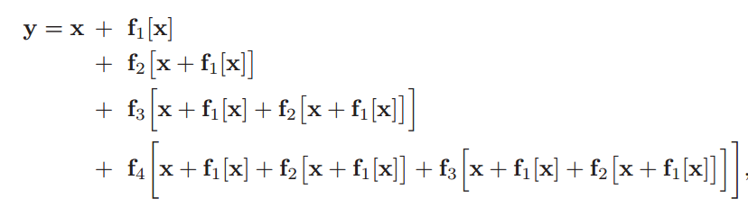
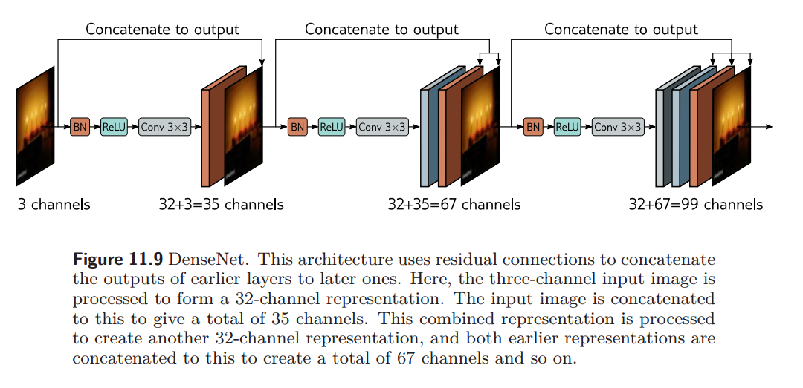
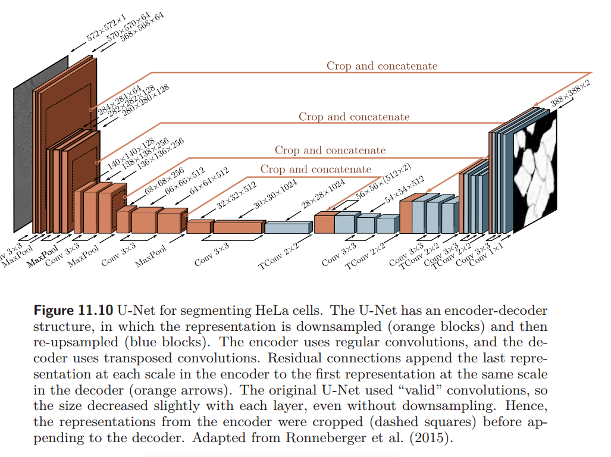
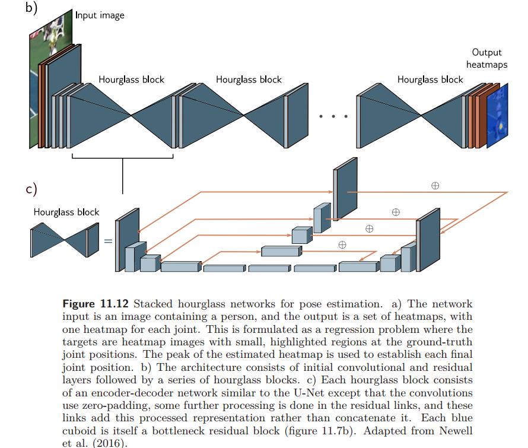

# Residual networks

## 1. Limitations of sequential processing

1. **梯度消失问题**：在深层神经网络中，反向传播时误差信号会逐层衰减，导致浅层神经元的权重几乎不更新，模型无法有效学习。这就像在多层传话游戏中，信息在传递过程中逐渐失真。
2. **训练效率低下**：随着网络层数的增加，训练时间会显著增加，而性能提升却不一定成正比。例如，VGG网络虽然比AlexNet更深，但训练速度也更慢。
3. **难以训练深层网络**：增加网络层数后，图像分类性能反而下降，这不仅在测试集上出现，也在训练集上出现，说明问题在于训练深层网络的难度，而非泛化能力。
4. **梯度破碎现象**：在深层网络中，微小的输入变化可能导致完全不同的梯度，这使得优化算法难以有效进展，因为损失函数的梯度变化过于剧烈。

## 2.Residual connections and residual blocks

### 2.1残差链接

1. **多层残差连接**：图中展示了多个层次的残差连接。每个残差块的输出不仅被传递到下一个残差块，还被传递到更后面的块中。例如，第一个残差块的输出被传递到第二个块，同时也被传递到第三个块，以此类推。
2. **函数组合**：每个残差块内部包含多个函数（如 *f*1、*f*2、*f*3、*f*4），这些函数的输出通过残差连接与输入相加，形成更复杂的特征表示。
3. **递归特征融合**：残差连接不仅仅是在相邻块之间进行，还涉及到跨多个块的特征融合。例如，第一个块的输出被多次用于后续块的输入，使得网络能够更好地利用前面层的特征信息。

### 2.2残差块顺序的重要性

如图，如果像a一样，将ReLU放在Linear的后面，那么所有的输出值都会变成非负，但是如果将ReLU放在Linear的前面则可以解决这个问题，例如：输入一个负值-1，经过第一次线性变换变成1（任何一个正数），那么通过ReLU还是1，再经过Linear变换可以变成正/负值，增加了网络的灵活性。

## 3.Batch normalization

### 3.1为什么要用批量归一化

1. **解决内部协变量偏移**：假设你有一个简单的两层神经网络，第一层的输出会被传递到第二层。如果没有批量归一化，第一层的参数更新可能会导致第二层的输入分布发生较大变化，从而影响第二层的学习效果。而使用批量归一化后，第二层的输入会被归一化到一个相对稳定的分布，使得第二层能够更高效地学习。
2. **缓解梯度消失/爆炸**：某些激活函数（如Sigmoid、tanh）在输入值较大或较小时，梯度会非常小，导致梯度消失。通过BN，输入值被归一化到一个相对稳定的范围，使得激活函数的输入更可能处于其敏感区域（即梯度较大的区域），从而减少了梯度消失的风险。

### 3.2批量归一化的操作

简单来说，就是对每一批上的每一个数值求均值和方差，然后通过（x-均值）/标准差的形式进行归一化，再通过缩放、移动等变换得到输出

## 4.Common residual architectures

### 4.1ResNet-200 model

这里想说一下残差块的处理，这里面一共有三个卷积，分别是1\*1,3\*3,1\*1,先通过1\*1卷积核减少通道数量（卷积核的通道数大小是跟输入的通道数大小是相同的，输出的大小取决于卷积核的数量，因此可以通过1\*1卷积核实现通过改变1\*1卷积核的数量，可以在不改变特征图空间分辨率的情况下增加或减少通道数），然后用3\*3卷积核减小表示大小，最后用1\*1卷积核回复原来的通道大小。

通过这个模型，图像分类的正确率进一步提升

### 4.2 DenseNet

采用密集连接，即每个层都与前面所有层直接连接，这意味着第*l*层的输入是前面所有层特征图的拼接。这种连接方式不仅增强了梯度的传播，还促进了特征的复用，使得网络能够更高效地利用前面层提取的特征

### 4.3 U-Net and hourglass networks

U-Net通过encoder-decoder架构，先进行下采样提取特征，再进行上采样回复原形，同时为了保证分辨率低的特征图能够恢复原样。关键是采用了Crop and concatenate方式将编码器部分的高分辨率特征与解码器部分的低分辨率特征进行融合，保留了图像的细节信息，增强了上下文信息的传递，从而提高了分割的精度。

hourglass networks示意图：

## 5.Why do nets with residual connections perform so well?

1. **残差网络的深度优势**：残差网络通过残差连接的设计，使得训练非常深的网络（如1000层）成为可能，这在传统网络中是难以实现的。

2. **深度并非唯一决定因素**：最初认为残差网络性能好是因为深，但有两点证据表明深度不是唯一关键：

   **浅而宽的网络有时更好**：层数少但每层通道数更多的残差网络，有时比深但窄的网络性能更好。这说明网络结构的其他方面（如宽度）也很重要。

   **梯度传播问题**：在非常深的网络中，梯度在训练时可能无法有效穿过很长的路径，导致网络的实际表现更像是多个较浅网络的组合，而非一个真正的超深网络。

3. **残差连接的独立价值**：现在认为，残差连接不仅使训练更深网络成为可能，还本身为网络性能带来了提升。证据是，有残差连接的网络在损失函数的最小值附近，损失曲面更平滑、更可预测，这可能使得网络更容易学习到泛化能力强的解。
